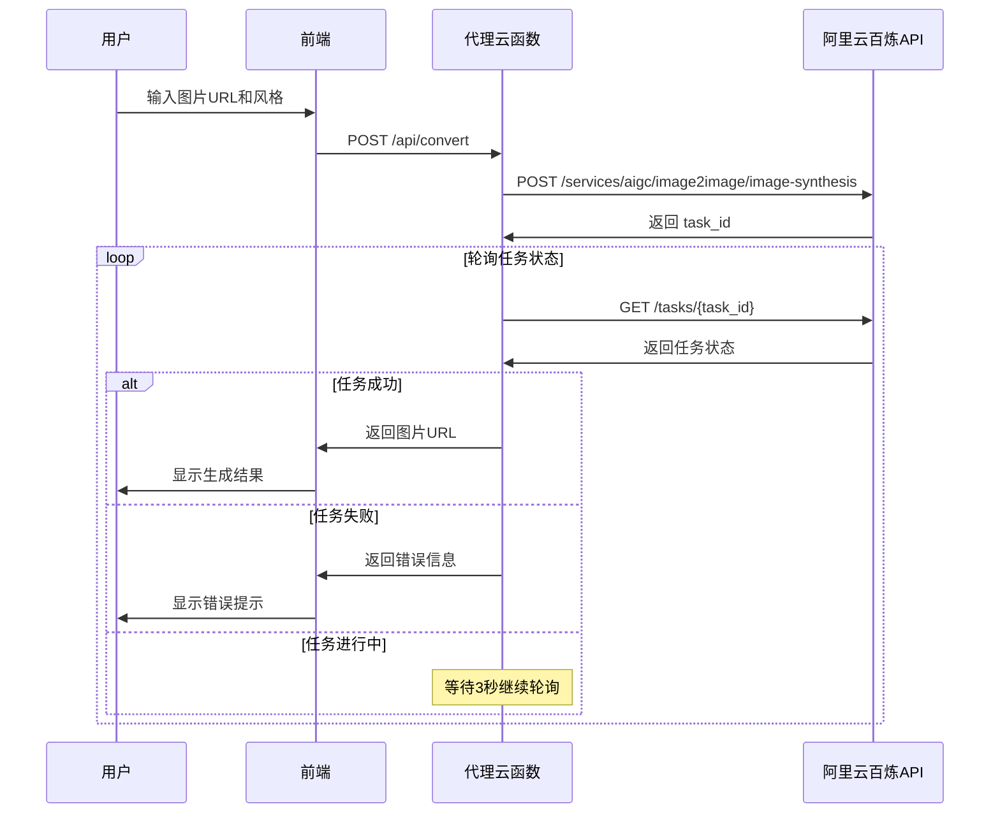

# 🎨 动漫头像生成器 V1.0

> 一个基于阿里云百炼 API 的在线动漫风格头像生成工具

## ✨ 项目特色

- 🎯 **真实API对接**：直接集成阿里云百炼 DashScope API
- 🚀 **异步处理**：完整实现"创建任务→轮询结果"的异步调用模式
- 🔐 **安全设计**：环境变量管理 API Key，无硬编码泄露风险
- 🌐 **CORS 支持**：解决跨域问题，支持 GitHub Pages 部署
- 📱 **响应式设计**：现代化 UI，支持移动端访问
- ⚡ **开箱即用**：V1.0 即为完整可用的生产版本

## 🏗️ 技术架构

```
前端 (GitHub Pages)
       ↓ HTTPS Request
中间层 (云函数代理)
       ↓ API 调用
后端 (阿里云百炼 API)
```

### 核心组件

1. **前端 (Frontend)**：纯静态网页 (HTML/CSS/JS)
2. **代理 (Proxy)**：Serverless 云函数，处理 CORS 和异步轮询
3. **后端 (Backend)**：阿里云百炼图像生成 API

## 📁 项目结构

```
anime-avatar-generator/
├── index.html              # 前端页面
├── script.js               # 前端逻辑
├── style.css               # 样式表
├── proxy-function.js       # 云函数代理
├── package.json            # 云函数依赖
└── README.md              # 项目文档
```

## 🚀 快速开始

### 第一步：部署云函数代理

#### 方式1：使用腾讯云 SCF

1. 登录 [腾讯云云函数控制台](https://console.cloud.tencent.com/scf)
2. 创建新函数，选择 "自定义创建"
3. 运行环境选择 `Node.js 14.18`
4. 上传 `proxy-function.js` 和 `package.json`
5. 设置环境变量：
   ```
   DASHSCOPE_API_KEY = sk-a641f6330e92448a8f27049ea6c1eda6
   ```
6. 配置触发器：选择 "API网关触发"
7. 获取触发器提供的访问 URL

#### 方式2：使用阿里云函数计算

1. 登录 [阿里云函数计算控制台](https://fc.console.aliyun.com/)
2. 创建服务和函数
3. 上传代码包 (包含 `proxy-function.js` 和 `package.json`)
4. 设置环境变量：
   ```
   DASHSCOPE_API_KEY = sk-a641f6330e92448a8f27049ea6c1eda6
   ```
5. 配置HTTP触发器
6. 获取触发器提供的访问 URL

#### 方式3：使用 Vercel

1. 将项目推送到 GitHub
2. 登录 [Vercel](https://vercel.com/)
3. 导入项目并部署
4. 在环境变量中设置：
   ```
   DASHSCOPE_API_KEY = sk-a641f6330e92448a8f27049ea6c1eda6
   ```

### 第二步：配置前端

1. 编辑 `script.js` 文件
2. 将第9行的云函数 URL 替换为实际地址：
   ```javascript
   PROXY_API_URL: 'https://你的云函数地址.com/api/convert',
   ```

### 第三步：部署前端

#### GitHub Pages 部署

1. 创建 GitHub 仓库并推送代码
2. 进入仓库 Settings → Pages
3. 选择部署源为 `main` 分支
4. 访问提供的 GitHub Pages URL

#### 本地测试

```bash
# 使用 Python 启动本地服务器
cd anime-avatar-generator
python -m http.server 8000

# 或使用 Node.js
npx http-server -p 8000

# 访问 http://localhost:8000
```

## 🔧 配置说明

### 环境变量

| 变量名 | 值 | 说明 |
|--------|----|----|
| `DASHSCOPE_API_KEY` | `sk-a641f6330e92448a8f27049ea6c1eda6` | 阿里云百炼 API 密钥 |

⚠️ **安全提醒**：绝对不要在代码中硬编码 API Key！

### API 参数配置

云函数中的关键配置项：

```javascript
// 轮询设置
const MAX_POLLING_ATTEMPTS = 20;  // 最大轮询次数
const POLLING_INTERVAL = 3000;    // 轮询间隔(毫秒)

// API 端点
const DASHSCOPE_BASE_URL = 'https://dashscope.aliyuncs.com/api/v1';
```

## 📖 使用指南

### 基本使用流程

1. **输入图片 URL**：需要公网可访问的图片链接
2. **选择风格**：如 "法国绘本风格"、"日式动漫风格" 等
3. **点击转换**：等待 30-60 秒生成结果
4. **下载保存**：右键保存生成的动漫风格头像

### 支持的图片格式

- **格式**：JPG、PNG、WEBP
- **大小**：建议 1MB 以内
- **分辨率**：建议 1024x1024 以下
- **访问**：必须支持公网直接访问

### 风格示例

| 风格描述 | 效果 |
|----------|------|
| 法国绘本风格 | 柔和色彩，手绘感强 |
| 日式动漫风格 | 经典动漫人物风格 |
| 水彩画风格 | 水彩渲染效果 |
| 卡通风格 | 简化的卡通形象 |

## 🔍 故障排除

### 常见问题

1. **"系统配置错误"**
   - 检查 `script.js` 中的 `PROXY_API_URL` 是否配置正确

2. **"API Key 未配置"**
   - 确认云函数环境变量 `DASHSCOPE_API_KEY` 已设置

3. **"跨域访问被阻止"**
   - 检查云函数是否正确设置了 CORS 响应头

4. **"任务处理超时"**
   - 检查输入的图片 URL 是否可访问
   - 尝试使用更小尺寸的图片

5. **"网络连接失败"**
   - 检查云函数是否正常运行
   - 确认云函数 URL 可以正常访问

### 调试方法

1. **检查浏览器控制台**：查看 JavaScript 错误信息
2. **查看云函数日志**：在云服务商控制台查看函数执行日志
3. **测试 API 连通性**：直接访问云函数 URL 测试响应

## 🔄 API 流程详解

### 完整调用链路



### API 响应格式

#### 成功响应

```json
{
  "success": true,
  "imageUrl": "https://dashscope-result-bj.oss-cn-beijing.aliyuncs.com/...",
  "message": "图像转换成功！"
}
```

#### 失败响应

```json
{
  "success": false,
  "error": "任务失败: 输入图片格式不支持"
}
```

## 🎯 版本信息

### V1.0 (当前版本)

- ✅ 阿里云百炼 API 集成
- ✅ 异步任务轮询机制
- ✅ CORS 跨域解决方案
- ✅ 现代化响应式 UI
- ✅ 错误处理和用户反馈
- ✅ 生产环境安全配置

### 路线图

- 🔄 V1.1：支持本地文件上传
- 🔄 V1.2：批量处理功能
- 🔄 V1.3：更多风格选项
- 🔄 V2.0：用户账户系统

## 📝 许可证

本项目基于 MIT 许可证开源。

## 🤝 贡献指南

欢迎提交 Issue 和 Pull Request！

1. Fork 本项目
2. 创建功能分支 (`git checkout -b feature/AmazingFeature`)
3. 提交更改 (`git commit -m 'Add some AmazingFeature'`)
4. 推送到分支 (`git push origin feature/AmazingFeature`)
5. 开启 Pull Request

## 📞 联系我们

- 项目地址：https://github.com/your-username/anime-avatar-generator
- 问题反馈：https://github.com/your-username/anime-avatar-generator/issues
- 在线演示：https://your-username.github.io/anime-avatar-generator

---

**⚡ 基于阿里云百炼 API | �� 让每个人都能拥有专属动漫头像** 